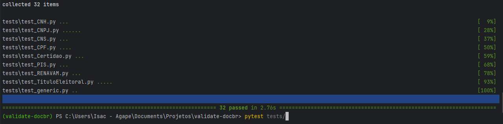
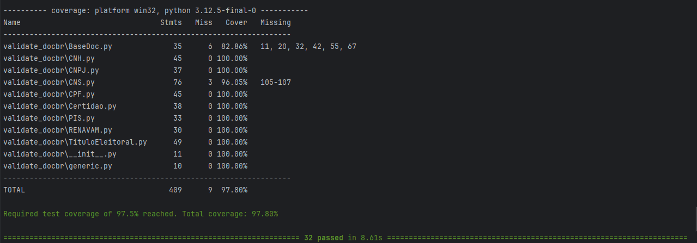
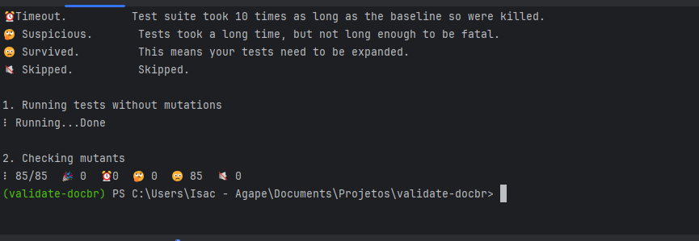

# Tutorial

## Configuração de ambiente
Os comandos executados neste documento deverão ser feitos a partir do diretório validate-docbr.
Para isto, execute o seguinte comando:
```
cd validate-docbr
 // insira o caminho completo até este diretório, se necessário
```
Algumas Tecnologias e configurações necessárias:
- Python: realizar instalação de acordo com o sistema operacional de sua máquina.
- IDE para execução do projeto. No meu caso, utilizei o VS Code.

É necessário criar um ambiente virtual para manter as dependências do projeto isoladas nesse projeto.
Para criar o ambiente virtual, execute o comando abaixo:
```
python -m venv // cria um ambiente virtual no diretório atual
```
O comando acima pode variar dependendo da versão do python instalado na sua máquina.

## Execução dos testes já criados do projeto
Para executar os testes, é necessário ter o pytest instalado no ambiente virtual.
Se ainda não possui, realize a instalação pelo seguinte comando:
```
pip install pytest
```
Agora, para executar os testes deste projeto, execute o seguinte comando:
```
pytest tests/
```
O comando acima executará todos os testes da pasta "tests". Nesta versão que baixei do github, 
possui 32 testes disponíveis em 9 arquivos.
Todos passaram com sucesso. Segue imagem da execução dos testes:


Será necessário mais duas bibliotecas serem instaladas: 
o pytest-cov para validar a cobertura de testes e o mutmut para realizar os testes de mutação. 
Os comandos para instalação são:
```
pip install pytest-cov
pip install mutmut
```

Para verificar a cobertura de testes do projeto, execute o comando:
```
pytest tests/ --cov
```


Para gerar o relatório de cobertura de teste, execute o comando:
```
pytest tests/ --cov=./ --cov-report html
```
Será criado uma nova pasta no seu projeto chamada htmlcov. 
Abra o arquivo index.html contido nessa pasta para visualizar o relatório de cobertura.

Com o mutmut já instalado, execute o seguinte comando para gerar os testes de mutação:
```
mutmut run
```

O mutmut irá informar quantos mutantes gerou, 
quantos desses mutantes os testes conseguiu matar, ou seja, apontar erros
e quantos não conseguiu.
Execute o comando a seguir para gerar um arquivo html contendo
a relação dos mudantes gerados por arquivo.
```
python -m mutmut html
```

Após a verificação dos mutantes gerados e ao perceber que com eles,
o código de teste ainda passou, o ideal é verificar o motivo de não ter informado erro
e corrigir os códigos de teste.
Executando os mutantes em um arquivo espeficicamente, o test_CPF.py, obtive o seguinte resultado:


